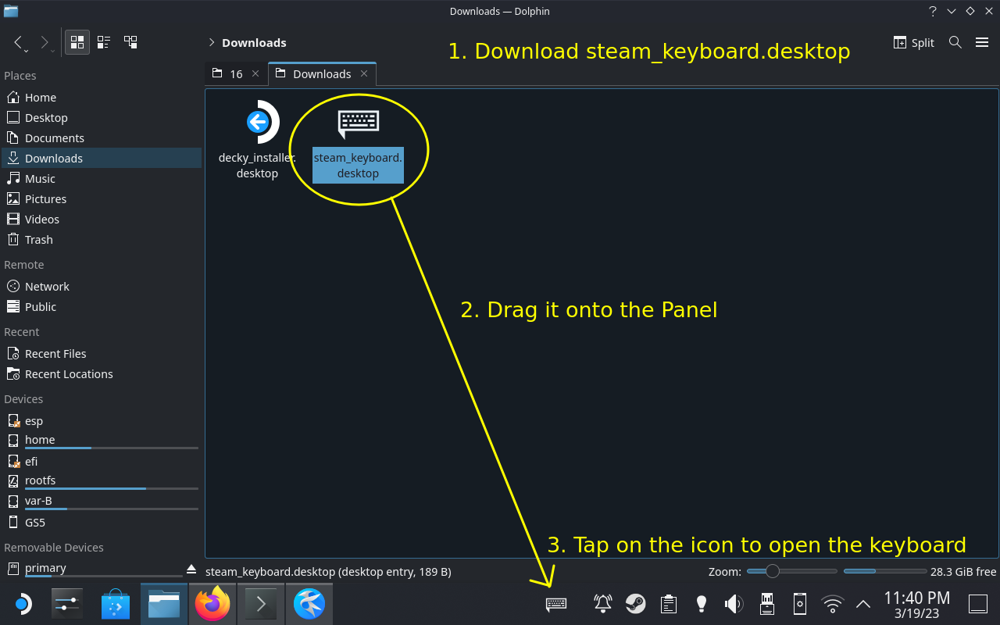

# steamdeck-keyboard-opener
Just a little shortcut to quickly open Steamdeck Onscreen Keyboard

Constantly having to press `Steam + X` to open the Steam keyboard was annoying.

In an ideal world, ibus should have opened the keyboard automatically when a text field is highlighted.
I have no idea why it doesn't work automatically. I have no idea why Valve did not use https://github.com/valve-project/steam-qt-keyboard-plugin .
So I made this little shortcut to open the keyboard.

## How to use
1) Download the [steam_keyboard.desktop](https://raw.githubusercontent.com/saidinesh5/steamdeck-keyboard-opener/master/steam_keyboard.desktop) file from this repo (Right click and "Save Link As..)
2) Drag and drop it onto the Panel
3) Enjoy single handed touchscreen usage with the shortcut - until Valve fixes the actual issue

